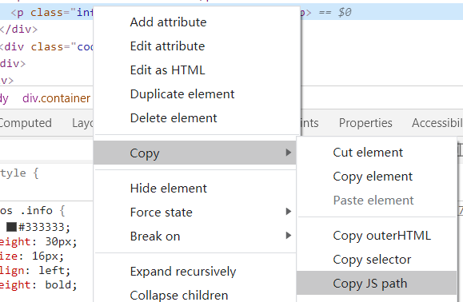

# Way-to-mnnu-free-in-js

It can help you to study how to change HTML element.

## HTML

Let's take [MNNU](http://dxg.mnnu.edu.cn/SPCP/Web/PersonActivity/MonitoringCard?zvUCe2qv0b5wjuIFP7upiOoaSpvKnRsWrIcdPHplu5h1kc3FuI06BiYJINSVfyHYd-5-FmfqhdFh8ziOm3EP5fJs4vN8d61V90Zs8DJErUuEKHoE1slBhDX3nPTg2u-K.shtml) as an example.

## Static way 

```
document.body.innerHTML=document.body.innerHTML.replace("2021.xx.xx xx:xx", new Date().getFullYear() + "." + ("0" + (new Date().getMonth() + 1)).slice(-2) + "." + ("0" + new Date().getDate()).slice(-2) + " " + new Date().toTimeString().substring(0,5));
```

## Dynamic way

### 1. Get the JS path



### 2. Edit javaScript

```
document.querySelector("body > div.container > div > div.infos > p:nth-child(7)").innerHTML="扫码时间："+new Date().getFullYear() + "." + ("0" + (new Date().getMonth() + 1)).slice(-2) + "." + ("0" + new Date().getDate()).slice(-2) + " " + new Date().toTimeString().substring(0,5)
```

## Out way

```
document.querySelector("body > div.container > div > div.infos > p:nth-child(6)").innerHTML="进出类型：出"
```

# This program is for personal study only.
# Do not use it in illegal ways.